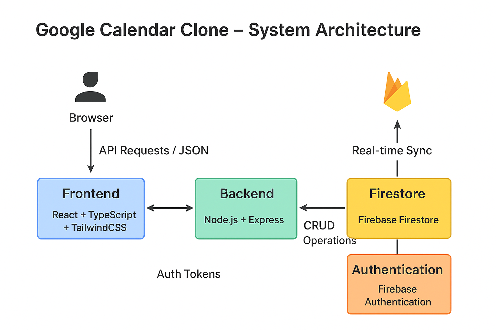
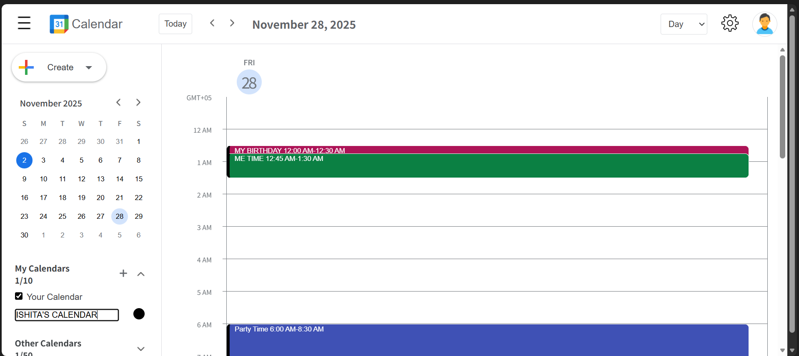
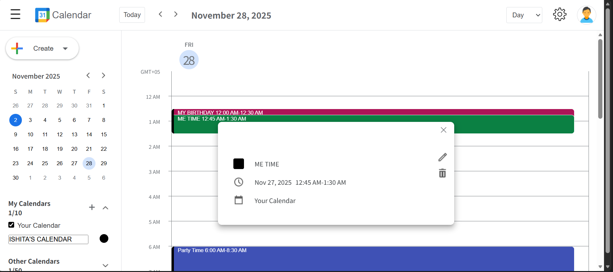
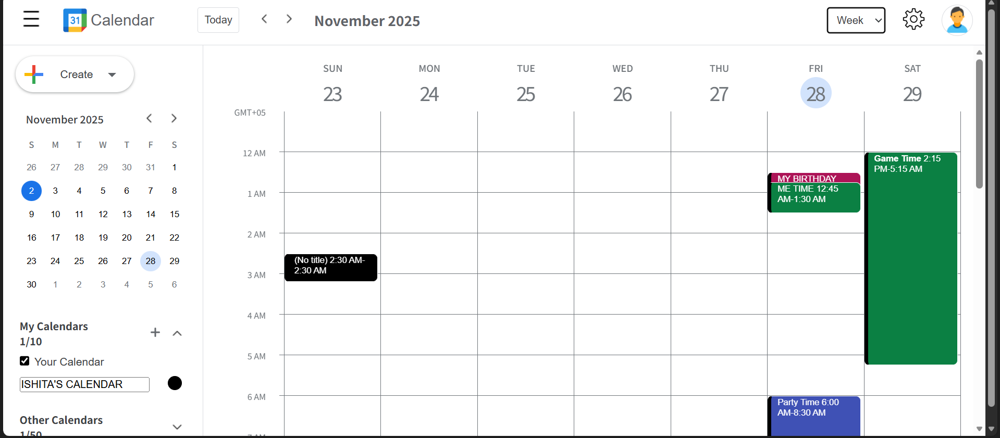

# Google Calendar Clone
Written in TypeScript.
A full-stack Google Calendar Clone built using React, TailwindCSS, Node.js, and Express that allows users to create, update, and delete events or tasks — with smooth UI interactions and dynamic views (day, week, month).

## Available Features

- [x] Calendars
- [x] Mini Calendar
- [x] Schedules: Event and Task
- [x] Calendar View Selection: Day, Week, and last 4 days
- [x] Draggable dialog w/ readjustable position
- [X] Time Indicator (fully displayed in the current day column)
- [x] External Holiday Events
- [x] User Settings
- [x] User Authentication with Firebase (Google account)
- [X] Firebase Firestore

###  Required configuration for .env Variables

**Client-side Configuration**

1. Create the following env files under /client: `.env` and `.env.development`
2. Define this variable `REACT_APP_HOLIDAY_API_URL` in each file accordingly.

_For example_:

```dotenv
REACT_APP_HOLIDAY_API_URL=https://your-holiday-api-url.com
```

3. Create the following .env variables under /server:

- `API_KEY`: Generate your API key [here](https://console.cloud.google.com/)
- `CALENDAR_ID`: By default, the value should be always `holiday@group.v.calendar.google.com`
- `CALENDAR_REGION (optional)`: If you're unsure about the value to initialize, use the following value: `en.usa`. To find the available options, refer to the list of supported regions on this [file](./client/src/data/localized-holiday-events.txt).

_For example_

```dotenv
API_KEY=your-api-key
CALENDAR_REGION=en.usa
CALENDAR_ID=holiday@group.v.calendar.google.com
```
## 1. Install Dependencies

### Install client dependencies
```cd client
npm install
```
### Install server dependencies
```cd ../server
npm install
```
## 2. Run the App
### Run client (frontend)
```
npm run dev
```
### In another terminal, run server (backend)
```
npm run dev
```


## 3. Architecture Overview
The project follows a modular full-stack architecture separating concerns between the frontend (React) and backend (Node + MongoDB).


🖥️ Frontend
React + Vite for fast, modular component-based UI.
TailwindCSS for utility-first styling.
Context API for managing global states like:
selected date
calendar view (day/week/month)
event/task data


⚙️ Backend
Node.js + Express to handle API routes.
MongoDB (Mongoose) for storing events and user data.
REST APIs handle:
GET /events — Fetch all events
POST /events — Create new event
PUT /events/:id — Update event
DELETE /events/:id — Delete event


google-calendar-clone/
│
├── client/           # Frontend (React + TailwindCSS)
│   ├── src/
│   ├── package.json
│
├── server/           # Backend (Node.js + Express + MongoDB)
│   ├── src/
│   ├── package.json
│
└── README.md

## client
client/
    ├── public/                 # Static assets served directly (favicon, index.html, etc.)
    └── src/
        ├── api/                # API calls and backend integration
        ├── assets/             # Images, icons, and other static resources
        ├── components/         # Reusable React UI components
        ├── data/               # Static data or configuration constants
        ├── functions/          # Utility or helper functions
        ├── hooks/              # Custom React hooks for state management
        ├── lib/                # Third-party or shared library functions
        ├── styles/             # Tailwind or custom CSS modules
        ├── util/               # Utility logic (date, formatting, etc.)
        │
        ├── App.tsx             # Main app component (root of React tree)
        ├── firebase.config.ts  # Firebase configuration and initialization
        ├── index.tsx           # Application entry point (renders <App />)
        ├── react-app-env.d.ts  # TypeScript environment definitions
        │
        ├── .eslintrc.json      # Linting configuration
        ├── package.json        # Project dependencies and scripts
        ├── package-lock.json   # Dependency lock file

## server
server/
    ├── api/                    # Contains backend API route handlers (e.g., /events, /auth)
    ├── node_modules/           # Installed backend dependencies
    │
    ├── package.json            # Defines scripts and dependencies for the server
    ├── package-lock.json       # Locks the exact versions of installed dependencies
    ├── tsconfig.json           # TypeScript compiler configuration
    ├── vercel.json             # Deployment configuration for Vercel

### Architecture Summary
Layer                    	           Technology	                               Description
Frontend (client)	          React + TypeScript + Tailwind	       Provides an interactive UI to view, create, and manage calendar events.
Backend (server)	          Node.js + Express + TypeScript	         Handles API routes, event logic, and serves client if needed.
Database	                      Firebase / Firestore	                    Stores user data, event details, and authentication info.
Deployment	                            Vercel	                            Used for deploying both client and server efficiently.

### Data Flow

User Interaction: User clicks on a date cell or adds an event.
Frontend Processing: React updates state and formats data using Day.js.
API Request: Axios sends a POST/GET request to Express routes.
Backend Logic: Node.js controller validates, saves, or retrieves event data.
Database Operation: MongoDB performs CRUD operations on events collection.
Response Sent: Data returned to frontend for UI update.

### 🧩 System Architecture

Frontend (React + Tailwind) ⇄ Backend (Node.js + Express) ⇄ Firestore (Database)




## 4. Business Logic and Edge Cases
✅ Core Business Rules

Date & Time Validation
Prevents users from adding events with invalid or past times.
Recurring Events
Supports logic for recurring daily/weekly/monthly events (if implemented).
Overlap Detection
When a new event is added, checks if the time range overlaps existing events.
Timezone Handling
Ensures correct time display across timezones (using Date and UTC).
All-day Events
Handled separately without time ranges — displayed in a special all-day section.
Data Sync
Automatically refreshes events after CRUD operations without page reload.


## 5. Animations & Interactions
Smooth Transitions: Implemented with Framer Motion or CSS transitions for calendar view changes (Day → Week → Month).
Dropdown Menus: Use React state for visibility toggling.
Modal Dialogs: Schedule or Task forms open with slide/fade effects.
Hover & Active States: Tailwind utility classes add subtle hover and click feedback.
Dynamic Rendering: Calendar cells and events are generated based on selected view and date.


## 6. Tools/Technologies/Libraries used
- React (Main UI Library)
- React Draggable
- React Select (UI library)
- Firebase (BaaS)
- Dayjs (Date and time API)
- Typescript (A superset language of JS)
- Sass (Stylesheet Lanuage)


## 7. Future Enhancements
Here are ideas to take this project further:

Feature	Description
🧍 User Authentication:   	Add login/signup with JWT for personalized calendars.
🔁 Event Sync:          	Integrate Google Calendar API for real-time sync.
🔔 Notifications:        	Add email or in-app reminders before events.
📱 Responsive Design:   	Improve mobile layout for small screens.
🧠 AI Scheduling:       	Suggest optimal meeting times using AI.
🌗 Dark Mode:           	Toggle theme using Context or CSS variables.


## 8. Screenshots


  
  

## 9. Credits


- Thanks to [mattn](https://github.com/mattn) for the available set of holiday events list by region
- Thanks to [icons8](https://icons8.com) for their assets

Author
Ishita Garg
💼 Passionate Computer Science Student | MERN Developer
📧 [ishitagarg2811@gmail.com]
🌐 [https://github.com/ishitagarg28]